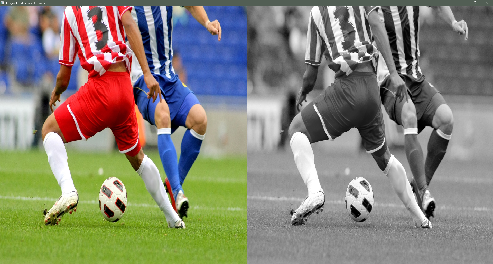
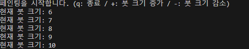
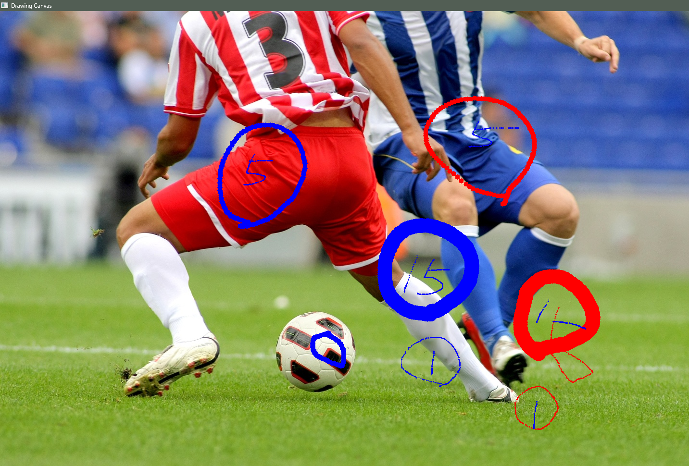
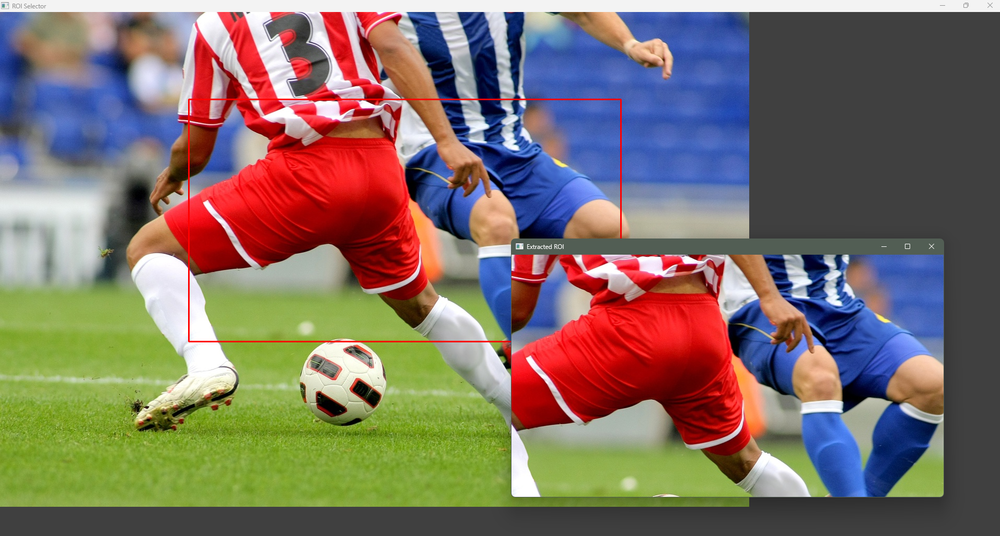
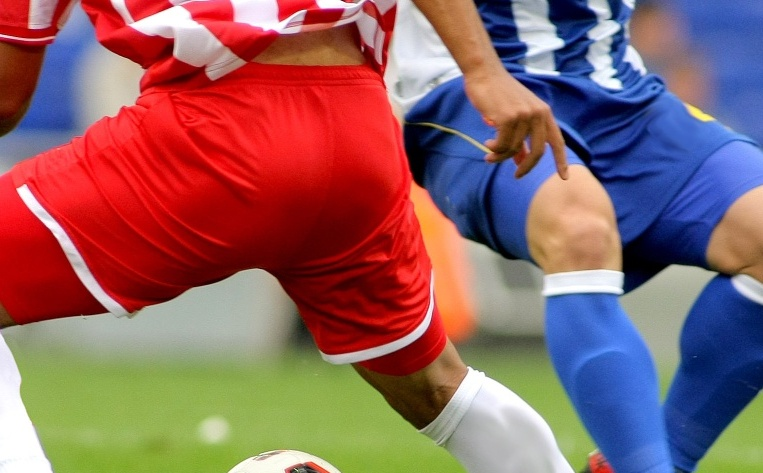

# OpenCV 기초 과제 (Assignment 1~3)

## 과제 개요
본 리포지토리는 OpenCV를 활용한 이미지 I/O, 이벤트 처리, ROI 추출 등의 기초 컴퓨터 비전 과제를 수행한 결과를 담고 있습니다.

---

## 과제 1: 이미지 불러오기 및 그레이스케일 변환
* **설명:** 원본 이미지를 불러온 뒤 그레이스케일로 변환하고, 두 이미지를 가로로 연결하여 출력합니다.
* **주요 구현 포인트:** `np.hstack()`을 사용하여 이미지를 병합할 때 배열의 차원(shape)을 일치시키는 것이 중요합니다. 1채널인 그레이스케일 이미지를 배열 병합이 가능하도록 3채널 차원으로 변환(`cv.COLOR_GRAY2BGR`)하여 차원 불일치 에러를 방지했습니다.
* **중간 결과물:** 
* **최종 결과물:**
  

## 과제 2: 페인팅 붓 크기 조절 기능 추가
* **설명:** 마우스 콜백을 이용해 드래그로 그림을 그리고, 키보드 입력(+, -)으로 붓 크기를 조절하는 페인팅 앱입니다.
* **주요 구현 포인트:** 콜백 함수(`mouse_callback`)와 메인`while` 루프 간의 상태(State) 동기화를 위해 전역 변수를 활용하여 현재 마우스 드래그 여부, 붓 크기, 색상 상태를 추적하고 업데이트하도록 구현하였습니다.
* **중간 결과물 (클릭 및 키보드 입력 테스트):**
  
* **최종 결과물 (크기 조절 및 드래그 적용):**
  

## 과제 3: 마우스로 영역 선택 및 ROI 추출
* **설명:** 드래그하여 관심 영역(ROI)을 지정하고, 이를 잘라내어 별도의 창에 띄우거나 파일로 저장합니다.
* **주요 구현 포인트:**
1. **슬라이싱 방향 예외 처리:** 마우스 드래그 방향(역방향 드래그)에 상관없이 Numpy 슬라이싱이 정상 작동하도록 `min()`, `max()` 함수를 사용해 좌표를 정렬했습니다.
2. **잔상 초기화:** 드래그 중이거나 새로운 영역을 선택할 때 이전 사각형의 잔상이 남지 않도록, `clone.copy()`를 활용해 매 렌더링마다 이미지를 원본 상태로 초기화하는 로직을 적용했습니다.
* **중간 결과물 (영역 드래그 중):**
  
* **최종 결과물 (추출 및 저장된 ROI):**
  